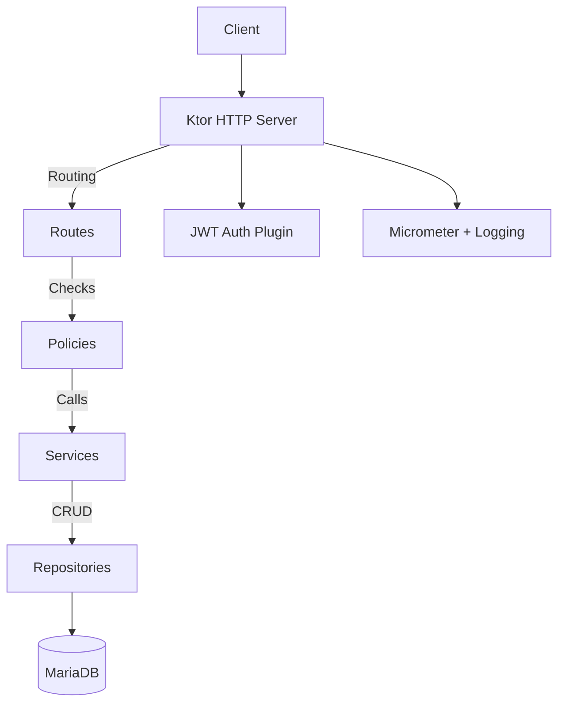
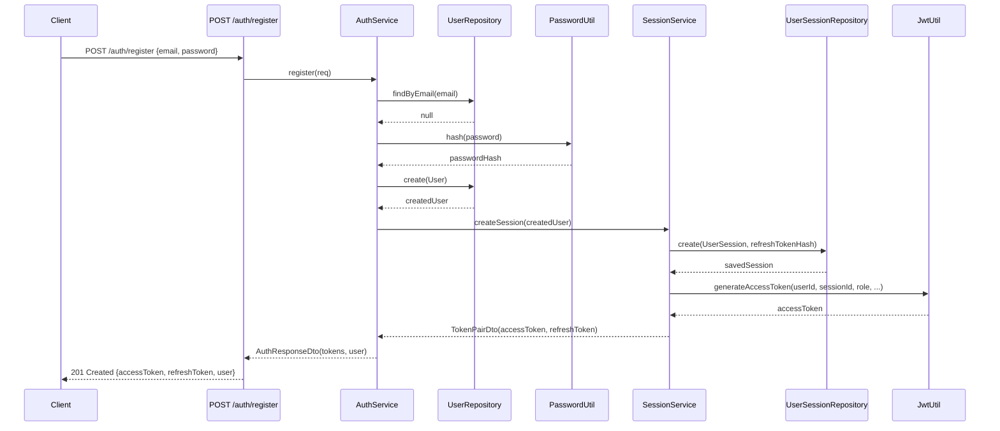
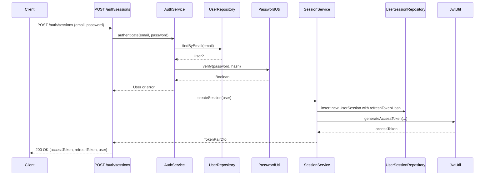
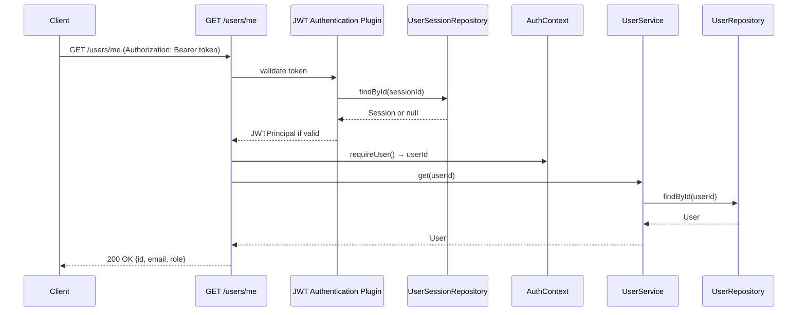
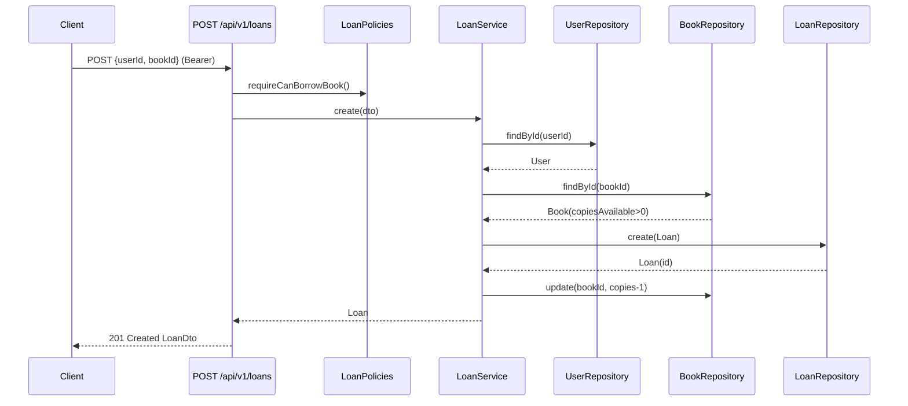
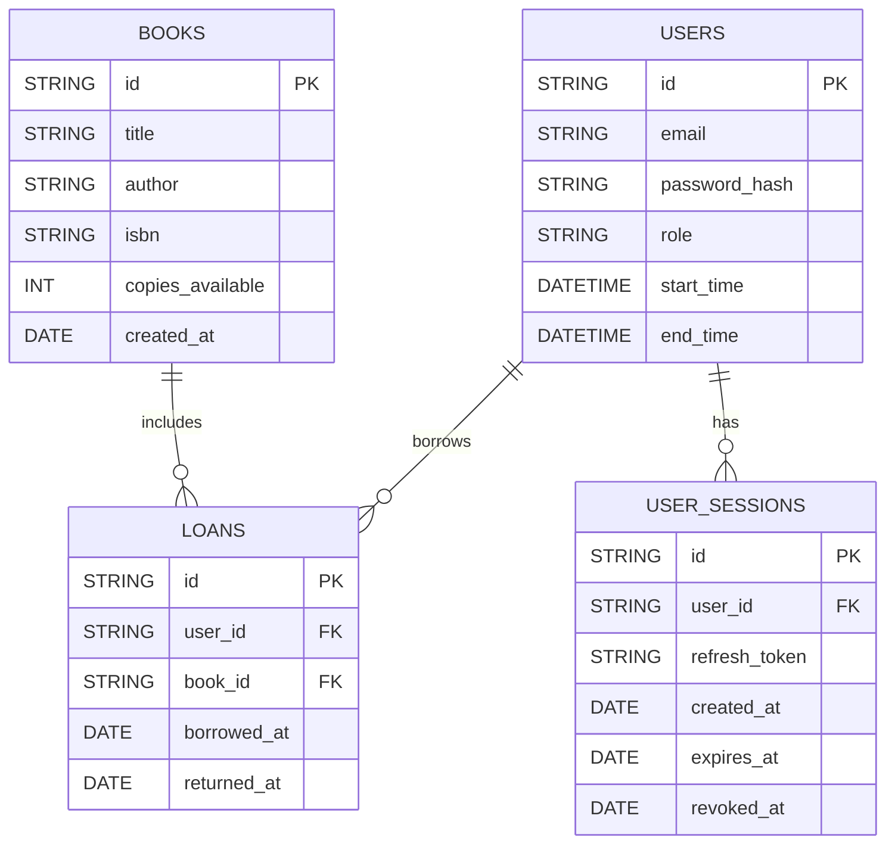

# Software Design Document

## Version History

| Version | Date       | Author             | Changes                                 |
| ------- | ---------- | ------------------ | --------------------------------------- |
| 0.1.0   | 2025-10-26 | Koen van Vlimmeren | Initial draft based on current codebase |


---

## Table of Contents

* [1. Introduction](#h-1-introduction)
* [2. Project Overview](#h-2-project-overview)
* [3. Requirements](#h-3-requirements)
* [4. Architecture & Design](#h-4-architecture--design)
* [5. Data Model](#h-5-data-model)
* [6. API Design (if applicable)](#h-6-api-design-if-applicable)
* [7. Interface Design (UI or API)](#h-7-interface-design-ui-or-api)
* [8. Testing](#h-8-testing)
* [9. Deployment / Setup](#h-9-deployment--setup)
* [10. Design Decisions](#h-10-design-decisions)
* [11. Conventions](#h-11-conventions)
* [12. Risks & Future Work](#h-12-risks-and-future-work)

---

## 1. Introduction

**Purpose:** Describe the design of a RESTful backend for a digital library. The service manages users, books, and loans with JWT-based auth and role/permission checks.

**Goal:** Provide a maintainable Ktor service with clear layering, DI, migrations, and consistent error handling.

**Scope:** Backend service only. No frontend. Includes authentication, authorization, CRUD for books and users, and loan workflows. Excludes payments, notifications, search relevance, and analytics dashboards.

---

## 2. Project Overview

### 2.1 Context

Assignment to build a Ktor Web API in Kotlin with real DB, migrations, and proper auth. Portfolio evidence for OO design, testing, and clean architecture.

### 2.2 High-Level Summary

Users register and log in. Members borrow and return books. Librarians and admins manage catalog and loans. Admins manage roles.

### 2.3 Stakeholders & Users

* Students and assessor(s)
* Admin, Librarian, Member roles

### 2.4 Constraints

* Timeboxed coursework delivery
* MariaDB schema via Flyway
* JVM, Ktor 3.x, Exposed v1
* No external message bus

---

## 3. Requirements

### 3.1 Functional Requirements

| ID    | Description                                    | Priority |
| ----- | ---------------------------------------------- | -------- |
| FR-1  | Register user with email/password              | High     |
| FR-2  | Login and issue JWT + refresh token            | High     |
| FR-3  | View own profile                               | Low      |
| FR-4  | Admin can list users and update roles          | Medium   |
| FR-5  | CRUD books (librarian/admin)                   | High     |
| FR-6  | List and view books (all authenticated roles)  | High     |
| FR-7  | Borrow book (member+) with inventory decrement | High     |
| FR-8  | Return loan with inventory increment           | High     |
| FR-9  | List loans: own or all (perm-gated)            | High     |
| FR-10 | Revoke sessions: current, by id, all           | Low      |
| FR-11 | Health endpoint                                | Low      |

### 3.2 Non-Functional Requirements (NFR)

| ID    | Category        | Description                                                                                                      |
| ----- | --------------- | ---------------------------------------------------------------------------------------------------------------- |
| NFR-1 | Security        | Argon2id password hashing; JWT with `sub`, `sid`, `role`; refresh tokens hashed and stored; per-role permissions |
| NFR-2 | Reliability     | Structured error handling via `StatusPages`; consistent JSON error schema; trace id in responses                 |
| NFR-3 | Performance     | Non-blocking DB access using Exposed in IO dispatcher; simple token bucket rate limiting                         |
| NFR-4 | Observability   | Micrometer Prometheus registry at `/metrics-micrometer`; request id via `CallId`; call logging                   |
| NFR-5 | Maintainability | DI via Koin; modular packages; DTO-mapper separation                                                             |
| NFR-6 | Portability     | External MariaDB plus optional embedded MariaDB4j for dev                                                        |

---

## 4. Architecture & Design

### 4.1 Overview

Layered design:

* **Routes** → **Policies** (permissions) → **Services** → **Repositories** → **DB tables**
* Cross-cutting: DI, Security, Serialization, Error handling, Monitoring.

### 4.2 System Diagram



### 4.3 Key Components

| Component      | Description                                                                     |
| -------------- | ------------------------------------------------------------------------------- |
| Routing        | `/routes/**` defines HTTP endpoints and binds policies and services             |
| Policies       | Permission checks per resource (`BookPolicies`, `LoanPolicies`, `UserPolicies`) |
| Services       | Business rules, composition, inventory adjustments                              |
| Repositories   | Exposed-based DB access implementations                                         |
| Security       | JWT auth, session validation, refresh rotation                                  |
| Error Handling | `StatusPages` exceptions + status wrappers to JSON                              |
| Monitoring     | CallId, logging, Micrometer endpoint                                            |
| DI             | Koin modules provide repos and services                                         |

### 4.4 Sequenece Diagrams

#### 4.4.1 **User Registration**



#### 4.4.2 User Login



#### 4.4.3 Access Protected Routes



#### 4.4.4 Borrow Book



---

## 5. Data Model

### 5.1 Entities

| Entity      | Description                                            |
| ----------- | ------------------------------------------------------ |
| User        | Account with email, passwordHash, role, timestamps     |
| Book        | Title, author, ISBN, copiesAvailable, createdAt        |
| Loan        | User-book link with borrowedAt and optional returnedAt |
| UserSession | Refresh session with expiry and optional revocation    |

### 5.2 ER Diagram



---

## 6. API Design

### 6.1 Overview

Versioned under `/api/v1`. JWT required for all except register/login/refresh and health.

### 6.2 Endpoint Overview

| Method | Endpoint                      | Description                             |
| ------ | ----------------------------- | --------------------------------------- |
| GET    | `/health`                     | Health probe                            |
| POST   | `/api/v1/auth/register`       | Register user                           |
| POST   | `/api/v1/auth/sessions`       | Login, issue tokens                     |
| GET    | `/api/v1/auth/sessions`       | List current user sessions              |
| DELETE | `/api/v1/auth/sessions`       | Logout current session                  |
| DELETE | `/api/v1/auth/sessions/{id}`  | Logout session by id                    |
| DELETE | `/api/v1/auth/sessions/all`   | Logout all sessions                     |
| POST   | `/api/v1/auth/tokens/refresh` | Refresh token pair                      |
| GET    | `/api/v1/users`               | List users (librarian/admin)            |
| GET    | `/api/v1/users/me`            | Get own profile                         |
| GET    | `/api/v1/users/{id}`          | Get user by id with policy              |
| PUT    | `/api/v1/users/{id}`          | Update own or others with policy        |
| PATCH  | `/api/v1/users/{id}/role`     | Admin role update                       |
| GET    | `/api/v1/books`               | List books                              |
| POST   | `/api/v1/books`               | Create book                             |
| GET    | `/api/v1/books/{id}`          | Get book                                |
| PUT    | `/api/v1/books/{id}`          | Update book                             |
| DELETE | `/api/v1/books/{id}`          | Delete book                             |
| GET    | `/api/v1/loans`               | List loans (own or all via `?all=true`) |
| GET    | `/api/v1/loans/{id}`          | Get loan by id with policy              |
| POST   | `/api/v1/loans`               | Borrow book                             |
| PATCH  | `/api/v1/loans/{id}/return`   | Return loan                             |
| DELETE | `/api/v1/loans/{id}`          | Delete loan                             |

### 6.3 Response Conventions

Successful responses return DTOs directly or arrays of DTOs. Errors use a standard envelope.

```json
{
  "success": false,
  "code": "[UPPER_SNAKE_CODE]",
  "message": "Human-readable message",
  "status": 400,
  "traceId": "<X-Request-ID>",
  "details": null
}
```

Notes:

* All unhandled exceptions return `INTERNAL_SERVER_ERROR` with traceId.
* Framework statuses (404/405) are wrapped into the same JSON by a send pipeline transform.

### 6.4 Rules

* Hierarchical endpoints, plural nouns
* Versioning at `/api/v1`
* Auth: `Authorization: Bearer <accessToken>`
* Permissions enforced via Policies at route level

---

## 7. Interface Design

### 7.1 For UI Projects

N/A.

### 7.2 For API-only Projects

Typical flows:

* Register → Login → Use JWT on protected calls
* Member borrows book → Loan created → Inventory decremented
* Return loan → Inventory incremented

---

## 8. Testing

### 8.1 Approach

* Unit tests for services (business rules)
* Integration tests for routes with in-memory app and test DB
* Manual checks with Postman for happy paths

### 8.2 Test Cases

| ID   | Description                        | Expected Result                           |
| ---- | ---------------------------------- | ----------------------------------------- |
| TC-1 | Register with valid email/password | 201 + AuthResponseDto                     |
| TC-2 | Login with valid credentials       | 200 + AuthResponseDto                     |
| TC-3 | List books with valid JWT          | 200 + \[BookDto\]                         |
| TC-4 | Create book as librarian           | 201 + BookDto                             |
| TC-5 | Borrow book when copiesAvailable>0 | 201 + LoanDto and copies-1                |
| TC-6 | Return active loan                 | 200 + LoanDto.returnedAt set and copies+1 |
| TC-7 | Unauthorized access without JWT    | 401 error envelope                        |

### 8.3 Tools

* Ktor server test engine
* Postman/Hoppscotch
* JUnit, Kotlinx Serialization JSON

---

## 9. Deployment / Setup

### 9.1 Local Setup

```bash
# Pre-req: Java 21+, Docker (optional)
./gradlew clean build
# Run app
./gradlew run
```

### 9.2 Deployment

* External MariaDB configured via `application.yaml` (`db.type: external`)
* Flyway auto-migration at startup
* Package as runnable jar or container

### 9.3 Environment Variables

| Variable       | Description              | Default                                |
| -------------- | ------------------------ | -------------------------------------- |
| `jwt.domain`   | JWT issuer               | `https://127.0.0.1:8080/`              |
| `jwt.audience` | JWT audience             | `library-api`                          |
| `jwt.realm`    | Ktor realm               | `Access to Library API`                |
| `jwt.secret`   | HMAC secret              | demo value in config; override in prod |
| `db.type`      | `external` or `embedded` | `external`                             |
| `db.host`      | DB host                  | `localhost`                            |
| `db.port`      | DB port                  | `3306`                                 |
| `db.name`      | DB name                  | `mariadb`                              |
| `db.user`      | DB user                  | `mariadb`                              |
| `db.password`  | DB password              | `mariadb`                              |

---

## 10. Design Decisions

| Decision                   | Reason                                                    |
| -------------------------- | --------------------------------------------------------- |
| Ktor + Netty               | Lightweight, idiomatic Kotlin HTTP server                 |
| Exposed ORM                | Type-safe SQL and table DSL                               |
| Flyway                     | Deterministic schema migrations                           |
| Koin                       | Simple DI, clear module wiring                            |
| JWT + sessions table       | Access token short-lived, refresh rotation and revocation |
| Argon2id                   | Strong password hashing                                   |
| Micrometer + Prometheus    | Standard metrics exposure                                 |
| Centralized error envelope | Consistent client experience and traceability             |

---

## 11. Conventions

### 11.1 Code & Naming

* Base package: `dev.koenv.libraryapi`
* Variables: `camelCase`; constants: `UPPER_SNAKE_CASE`
* Endpoints: plural, versioned, hierarchical where needed

### 11.2 Error Handling

* Throw `ApiException(http, code?, message)`
* `StatusPages` maps exceptions to `ErrorResponse`
* Bare `HttpStatusCode` responses are wrapped into JSON in send pipeline

### 11.3 Data & Dates

* JSON: Kotlinx Serialization
* Date-time: `kotlinx.datetime` in UTC
* IDs: UUID v4

### 11.4 Formatting

* Indent: 4 spaces; LF endings

### 11.5 Documentation

* Location: `docs/`
* Bump document version on major changes

---

## 12. Risks & Future Work

### 12.1 Known Limitations

* No pagination on list endpoints
* No book search or filtering
* No optimistic locking on inventory
* Minimal rate limiting

### 12.2 Future Improvements

* Add pagination and query filters
* Add admin stats endpoints
* Add email verification and password reset
* Add CI with test containers

### 12.3 Risks

| ID  | Description         | Mitigation                                                   |
| --- | ------------------- | ------------------------------------------------------------ |
| R1  | JWT secret leakage  | Use vault or env injection; rotate regularly                 |
| R2  | Refresh token theft | Store only hashed tokens; revoke on use; device-bound checks |
| R3  | DB failures         | Flyway baseline and backups; health checks                   |
